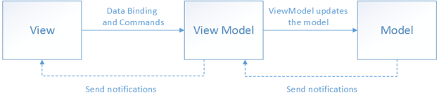
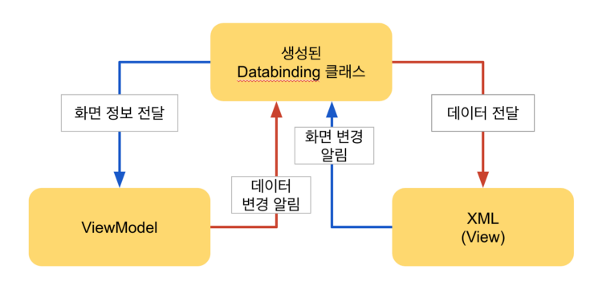

# MVVM (Model-View-ViewModel)

+ 구글의 Android Architecture Component(AAC)의 ViewModel과는 **전혀** 무관합니다.



### View

View는 화면에 표시되는 레이아웃을 관여. 비즈니스 로직을 배제하며, UI관련 로직을 수행.


### ViewModel

View에 연결할 데이터, 명령. 변화를 View에게 알림.


### View, ViewModel

View는 ViewModel만을 알고, ViewModel은 Model만을 앎.

View는 ViewModel을 옵저빙하다가 변화가 관찰되면 화면을 갱신.


### View와 ViewModel 연결

```kotlin
class Activity : AppCompatActivity(){
  override fun onCreate(bundle : Bundle?){
    val tv = findViewById<TextView>(R.id.tv)
    //ViewModel 정의
    val viewModel = ViewModel()
    //ViewModel 옵저빙
    viewModel.name.observe{
      tv.text = it
    }
    tv.setOnClickListener{ viewModel.clickName() }
  }
}

class ViewModel(){
  val name = ObservableField("이름")
  fun clickName{ name.set("클릭") }
}
```

위와 같은 코드는 서로간의 의존성이 지속됨.

따라서, DataBinding이 필요함.



DataBinding은 MVVM을 구현하는 데에 있어 필수 기술로도 간주함.

DataBinding은 View와 ViewModel 사이에서 매개체가 됨.

Model의 데이터 변경은 LiveData나 RxJava를 통해 구현.

DataBinding을 통해 변화 전달, 명령 전달을 UI코드로 정의 => View, ViewModel 사이의 독립성 증가.


```gradle
// build.gradle (Module : app)

apply plugin: 'kotlin-kapt'

android{
  ...
  dataBinding{
    enabled = true
  }
}
```

```xml
<?xml version="1.0" encoding="utf-8"?>
<!-- 루트는 layout 태그.-->
<layout
        xmlns:android="http://schemas.android.com/apk/res/android"
        xmlns:tools="http://schemas.android.com/tools"
        xmlns:app="http://schemas.android.com/apk/res-auto"
        tools:context=".MainActivity">

<!-- DataBinding 정의-->
    <data>
        <variable name="viewmodel" type="com.nwar.individual.mvvm.viewModel.MainActivityViewModel"/>
    </data>

    <android.support.constraint.ConstraintLayout
            android:layout_width="match_parent"
            android:layout_height="match_parent">

        <TextView
                android:layout_width="wrap_content"
                android:layout_height="wrap_content"
                android:id="@+id/main_maintext_tv"
                android:text="@{viewmodel.name}"
                android:onClick="@{() -> viewmodel.clickName()}"
                app:layout_constraintBottom_toBottomOf="parent"
                app:layout_constraintLeft_toLeftOf="parent"
                app:layout_constraintRight_toRightOf="parent"
                app:layout_constraintTop_toTopOf="parent"/>

    </android.support.constraint.ConstraintLayout>
</layout>
```

```kotlin
class Activity : AppCompatActivity() {

    override fun onCreate(savedInstanceState: Bundle?) {
        super.onCreate(savedInstanceState)
        val binding : ActivityMainBinding = DataBindingUtil.setContentView(this,R.layout.activity_main)
        val viewModel = MainActivityViewModel()
        binding.setVariable(BR.viewmodel, viewModel)
    }
}
```

