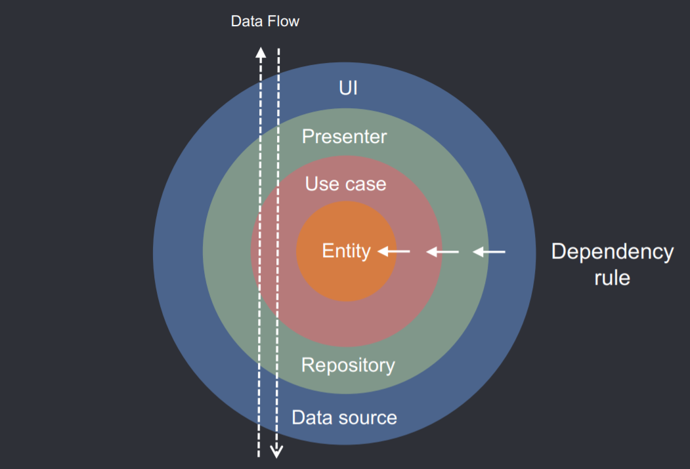

# Clean Architecture

### 개요

Clean Architecture는 Robert C. Martin (Uncle Bob)이 고안한 소프트웨어 아키텍처.

Clean Architecture는 소프트웨어를 사용자 입장에서 봤을 때, 소프트웨어의 "본질"에 중점을 두어 설계.

소프트웨어의 본질? : 사용자가 원하고자, 보고자 하는 정보 자체.

아래 사진과 같이, 의존성은 안쪽으로 흐른다. 따라서, UI의 변경은 다른 레이어에 아무런 영향도 끼치지 않음.

플랫폼에 의존적이지 않은 아키텍쳐.

### Preview

### Layer

1. Presentation Layer : 사용자에게 표현하는 방식을 정의.

   UI는 ViewModel에 의해 조정되고, 1개 혹은 여러개의 Use Case를 실행한다.

2. Domain Layer : 사용자가 원하는 정보, 동작들을 가지고 있는 레이어.

   가장 안쪽에 있는 레이어. 다른 레이어와의 의존성을 갖지 않는다.

   Entity(data Class=사용자가 원하는 정보), Use Case(사용자가 원하는 행동),

   Data Layer의 Repository interface를 가지고 있다.

3. Data Layer : 외부/내부 저장공간에 접근해 정보를 가져오는 레이어.

   Repository 구현체와 1개 혹은 여러 개의 Data Source를 가지고 있다.

   Repository는 서로 다른 Data Source에서 가져온 데이터를 가공한다.

   Domain Layer에 의존성을 가지고 있다.

